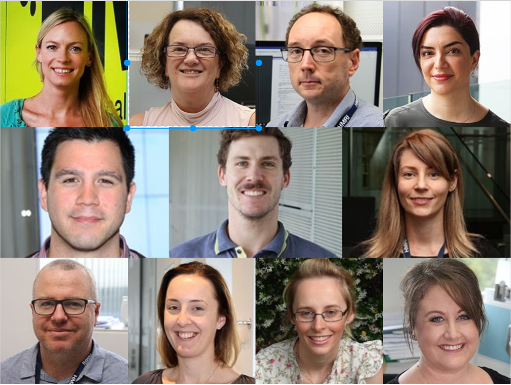

```{r setup, include=FALSE}
knitr::opts_chunk$set(fig.retina = 3)
```

```{r load_packages, message=FALSE, warning=FALSE, include=FALSE} 
library(fontawesome)
```


class: title-slide   

# CReDITSS


--
## .saltinline[C]linical .saltinline[Re]search .saltinline[D]esign .saltinline[IT] and .saltinline[S]tatistical .saltinline[S]ervices


--

.opacity[Mission:  Reliable, innovative, and collaborative data analytic solutions]


---

layout: true
background-image: url(HMRI_logo_col.png.png)
background-position: bottom right
background-size: 10%    

---
class: center
# Who are we?

```{r out.width = '35%', echo=FALSE}
# url
 

```


 .heatinline[**Come speak to us sooner rather than later!**]

---
class: 
# Our Services

--
### `r fa("lightbulb")`Trial design  

--

### `r fa("database")` Redcap database development


--

### `r fa("bolt")` Randomisation

--
### `r fa("tachometer-alt")` Dashboards 

--
### `r fa("laptop")`  Analyses 

--

### `r fa("chart-line")` Data visualisation and reporting

---
 
# Contact us


<br> <br> 
`r fa("envelope")` Michelle.Gillam@hmri.org.au <br></br>
`r fa("phone")`  40420500
